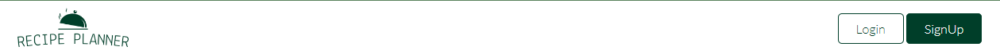
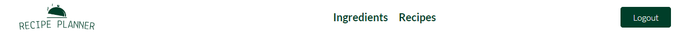
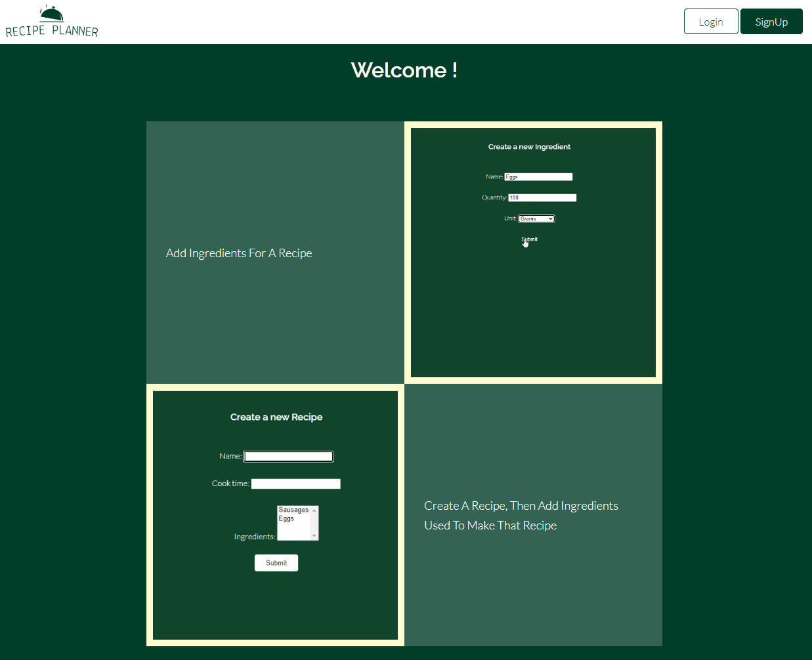
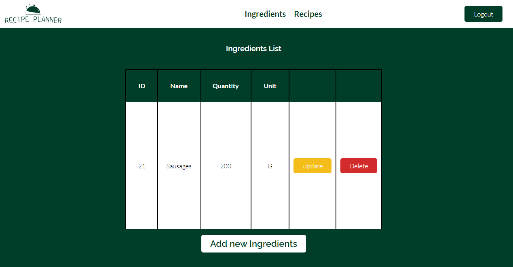
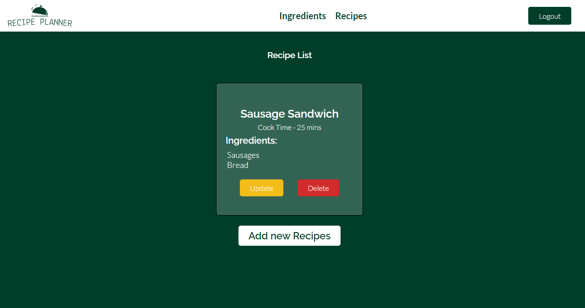
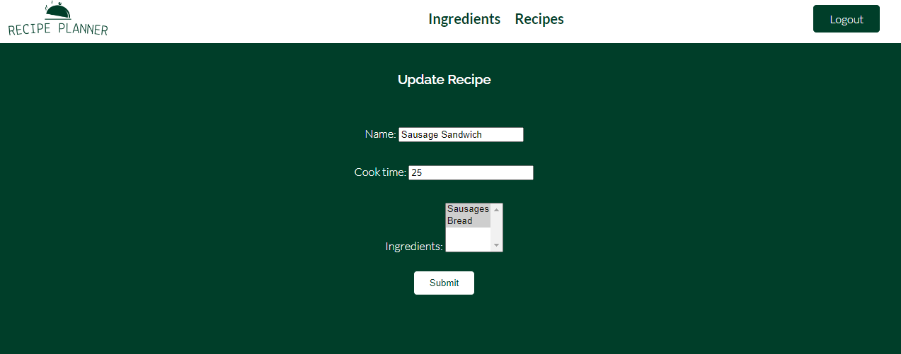
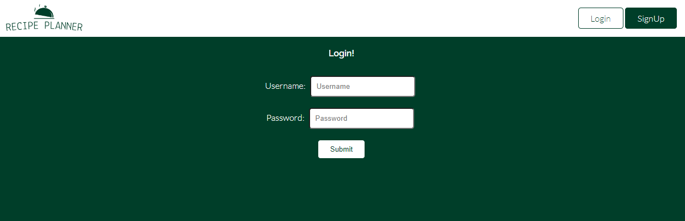
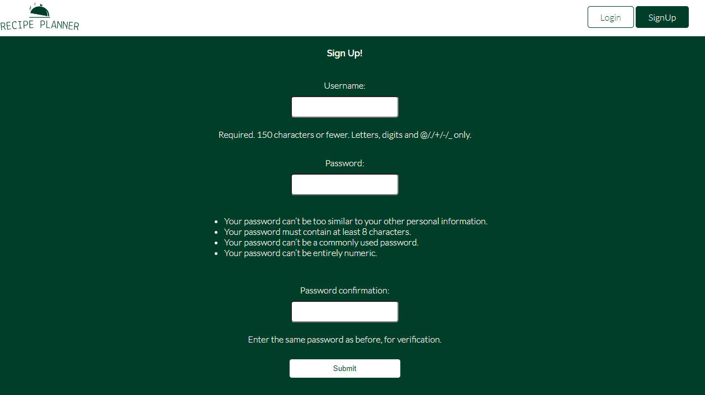
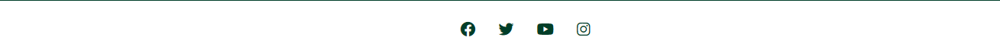

<h1 align="center">Recipe Planner</h1>

## BackGround

This is a app that allows the user to add ingredients to their shopping list. And then assign those ingredients to a recipie you want to make with those ingredients. It has a landing page which shows you video instructions on how to add ingredients and assign the ingredients to its respective recipe. 
There is also an ingredients page where you can create ingredients providing the ingredients name, quantity and unit. On this page you can also update an ingredient and delete an ingredient.
Additionally there is a recipe page, in which you can create a recipe and assign the ingredients to that recipe. It also allows you to provide a name and a cook time for the recipe.
Lastly users who would like to use this app are given the option to sign up and have user specific data populated from the database. It was designed responsively so devices from phones to monitors can view them.

<h2 align="center"></h2>

## User Experience (UX)

-   ### User stories
    -   #### First Time Visitor Goals

        1. As a First Time Visitor, I want to easily understand the main purpose of the site and learn more about what the site has to offer.
        2. As a First Time Visitor, I want to be able to easily navigate throughout the site to find relevant content.
        3. As a First Time Visitor, I want to be able to create Ingredients, so i can add to my list of Ingredients.
        4. As a First Time Visitor, I want to be able to create Recipes, so i can add to my list of Recipes.
        5. As a First Time Visitor, I want to be able to view Ingredients, so i can see my list of Ingredients.
        7. As a First Time Visitor, I want to be able to view Recipes, so i can see my list of Recipes.
        8. As a First Time Visitor, I want to be able to update Recipes, so i can make changes to my list of Recipes.
        9. As a First Time Visitor, I want to be able to update Ingredients, so i can make changes to my list of Ingredients.
        10. As a First Time Visitor, I want to be able to delete Recipes, so i can delete Recipes.
        11. As a First Time Visitor, I want to be able to delete Ingredients, so i can delete Ingredients.
        12. As a First Time Visitor, I want to be able to sign up, so i can create my own account.
    
    -   #### Returning Visitor Goals

        1. As a Returning Visitor, I want to see Ingredients that i have added to my ingredients list.
        2. As a Returning Visitor, I want to see Recipes that i have added to my ingredients list.

    -   #### Frequent User Goals
        1. As a Frequent User, I want to use this app as a shopping list.

-   ### Design
    -   #### Colour Scheme
        -   The three main color schemes are white and green.
    -   #### Typography
        -   Two google fonts were used in making this website. Raleway for the headings and Lato for the rest of the text across the website. Sans Serif and cursive as the fallback font in case for any reason the font isn't being imported into the site correctly. 
    -   #### Imagery
        -   Our company Logo which is featured on every page, located in the top left of the navbar.
        -   Two videos on the home screen showing users how to create an ingredient and how to assign the ingredient to a recipe.

## Features
### Home Page

#### Navigation
- Positioned at the top of the page. On the left it has the site logo.
- To the right it has the two buttons Login and Sign Up. When you create an account and login, you have access to the Ingredients page and the Recipes page. Also the Login and Sign Up buttons are removed and it is replaced with a Logout button.

#### Landing Page 
- Users are greeted with a short video clip of how to add Ingredients.
- Users are greeted with a short video clip of how to add Recipes.

### Ingredients Page

#### Ingredients Table

- Users are directed to a table that will show ingredients they have added to their list.
- If user has no ingredients in their list a paragraph above the table shows message letting the user know their list is empty.
- The table is populated with the Ingredient ID, Name, Quantity and unit. Aswell as buttons for update and delete.
- A button below the table allowing users to easily add a new ingredient.

### Recipe Page

### Recipe Card List
- Users are then encouraged to add a new Recipe to their list. 
- If user has no Recipes in their list a paragraph will be displayed showing a message letting the user know their list is empty.
- Once a recipe has been added to a users list, a card will show the name of the recipe, the cook time and the ingredients that are associated with that recipe.
- The card also has update and delete buttons that allow users to modify their recipes or delete them.
- A button is shown below the list of recipes allowing users to easily add a new recipe.

### Update Page
- Both Recipe and Ingredients have the ability to update an individual entry.
- You can make changes to 1 field or all fields.

### Login Page
- Allows users who have an account to login.

### Sign Up Page
- Allows users who don't have an account to signup for one.

### Footer
- The footer has links which use font awesome fonts for facebook, youtube, twitter and instagram accounts.
- When links are clicked on they open our social media accounts in a new tab.

### Languages Used

-   [HTML5](https://en.wikipedia.org/wiki/HTML5)
-   [CSS3](https://en.wikipedia.org/wiki/Cascading_Style_Sheets)
-   [Javascipt](https://en.wikipedia.org/wiki/JavaScript)
-   [Python](https://en.wikipedia.org/wiki/Python_(programming_language))

### Frameworks, Libraries & Programs Used

1. [Google Fonts:](https://fonts.google.com/)
    - Google fonts were used to import the 'Lato' and 'Raleway' font into the base.html file which is used on all pages throughout the project.
2. [Font Awesome:](https://fontawesome.com/)
    - Font Awesome was used on all pages throughout the website to add icons for aesthetic and UX purposes.
3. [Git](https://git-scm.com/)
    - Git was used for version control by utilizing the Gitpod terminal to commit to Git and Push to GitHub.
4. [GitHub:](https://github.com/)
    - GitHub is used to store the projects code after being pushed from Git.
5. [Django](https://en.wikipedia.org/wiki/Django_(web_framework))
    - Django was used to build crud functionality and allowed me to use a database to save user data to.

## Testing

The W3C Markup Validator and W3C CSS Validator Services were used to validate every page of the project to ensure there were no syntax errors in the project.

### HTML Validator
-   [W3C HTML Validator](https://validator.w3.org/) - [Results]()

### CSS Validator
-   [W3C CSS Validator](https://jigsaw.w3.org/css-validator/#validate_by_input) - [Results]()

### Python Validator
-   [Python Validator](https://infoheap.com/python-lint-online/) - [Results]()

### Testing User Stories from User Experience (UX) Section

-   #### First Time Visitor

    1. As a First Time Visitor, I want to easily understand the main purpose of the site and create an account so i can start adding things to my list.

        1. Upon entering the site, users are automatically greeted with a clean and easily readable header and navigation bar.
        2. The main points on the homepage are a video along with a couple lines of instructions about how to use the app.
        3. The user can login or signup to use the app, indicated by the buttons at the top of the navbar.

    2. As a First Time Visitor, I want to be able to easily be able to navigate throughout the site to find content.

        1. The website is fluid, designed with UX at the top of my priorities. Each page has navigation bar, each link descriptive and is designed so that the user can easily remember the design of my page after a couple clicks.
        2. At the bottom of each page there is links to our social media accounts.
        
    3. As a First Time Visitor, I want to look for a link directing me to what ive come to the site for.
        1. Once the new visitor has arrived on the page they are immediately met with a site logo that explains what the site is for. 
        2. The user is also given a short tutorial of how to use the app.
        2. The user can also scroll to the bottom of any page on the site to locate social media links in the footer.
    
    4. As a First Time Visitor, I want to be able to create an Ingredient or Recipie
        1. Once user has created an account, they can add Ingredients to their list.
        2. The user will be able to create a Recipe once they have added their Ingredients to their list.

    5. As a First Time Visitor, I want to be able to update an Ingredient or Recipie
        1. Once a user has added an ingredient to their list, they are able to update any entry in the database they have made.
        2. Once a user has added an ingredient to their list, they are able to update any entry in the database they have made.
    
    6. As a First Time Visitor, I want to be able to delete an Ingredient or Recipie
        1. Once a user has added an ingredient to their list, they are able to delete any entry in the database they have made.
        2. Once a user has added an ingredient to their list, they are able to delete any entry in the database they have made.

-   #### Returning Visitor

    1. As a Returning Visitor, I want to add more Ingredients to my list and new Recipes. 

        1. The user can easily get back up to speed where they left off upon loggin in. 
        2. Responsive site can be used on any device screen size.

-   #### Frequent User

    1. As a Frequent User, I want to use this as my main recipe planner and/or a shopping list app.

        1. The frequent user would remember how to navigate through the app and have all data saved previously, restored in everyone of their sessions.

### Known Bugs

- N/A

## Deployment

### Heroku

- Step 1: Scaffold a Django Project for Hosting
  - Create a Virtual Environment
  - Install Project Dependencies
  - Update Local Database Schema (Optional)
  - Run a Local Development Server
- Step 2: Create a Local Git Repository
  - Initialize an Empty Git Repository
  - Specify Untracked Files
  - Make the First Commit
- Step 3: Create a Free Heroku Account
  - Sign Up
  - Enable Multi-Factor Authentication (Optional)
  - Add a Payment Method (Optional)
- Step 4: Install the Heroku CLI
- Step 5: Log In With the Heroku CLI
- Step 6: Create a Heroku App
- Step 7: Deploy Your Django Project to Heroku
  - Choose a Buildpack
  - Choose the Python Version (Optional)
  - Specify Processes to Run
  - Configure Django
  - Configure the Heroku App
  - Make an App Release
- Step 8: Set Up a Relational Database
  - Provision a PostgreSQL Server
  - Update Remote Database Schema
  - Populate the Database

## Credits

### Code

- N/A

### Content

-   All content was written by the developer.

### Media

-   
### Acknowledgements
- Codecademy
- Denis Ivy Youtube videos
- W3c
- Scrimba
- Tech with Tim Youtube videos